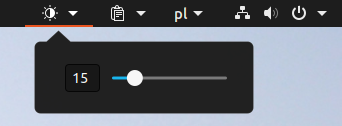

For this extension to work it is needed first of all install ddcutil by running 
	sudo apt-get install ddcutil

Later you have to allow ddcutil to run as sudo. You can do this by editing your sudoer file as follows:

1. Open a terminal (ctrl+alt+T)
2. Enter the following command
	sudo visudo
3. Once the file opens paste (ctrl+shift+v) the following command and replacing username with the your own username 
	username ALL=(ALL) NOPASSWD: /usr/bin/ddcutil

Make sure that /usr/bin/ddcutil is the right path by running 
	which ddcutil
